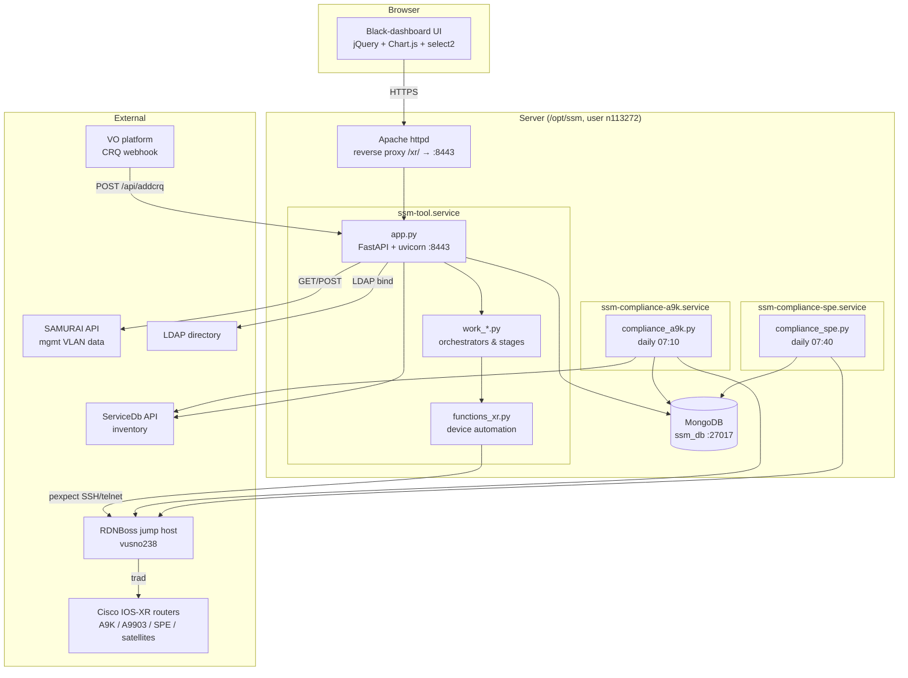
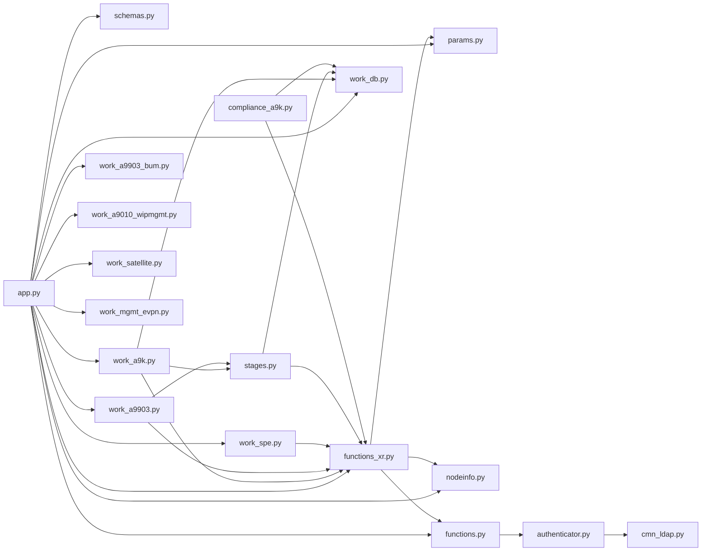

# 02 — Architecture

← [Project Overview](01-project-overview.md) | Index | Next: [Folder Structure](03-folder-structure.md) →

## High-level architecture

SSM is a **monolithic Python application with three processes** plus several external
dependencies. There is no microservice decomposition; the "services" are just three
entry-point scripts sharing the same codebase and MongoDB.



## Component responsibilities

| Component                          | Responsibility                                                                                               |
| ---------------------------------- | ------------------------------------------------------------------------------------------------------------ |
| **Apache httpd**                   | TLS termination, reverse-proxy `/xr/` → `localhost:8443`                                                     |
| **app.py**                         | HTTP routing, auth (cookie JWT), template rendering, `/api/*`, flow dispatch, thread-pool fan-out for checks |
| **work_*.py**                      | Per-platform orchestrators + stage functions (the actual procedures)                                         |
| **functions_xr.py**                | Low-level device automation: connect, send CLI, expect prompt, parse output                                  |
| **functions.py**                   | Cross-cutting helpers: logging, auth wrapper, log-file viewer, jump-host connect                             |
| **work_db.py**                     | The single MongoDB gateway: locks, maps, logs, stats, CRQ, on-demand nodes                                   |
| **compliance_a9k/spe.py**          | Standalone daily audits; write results consumed by the dashboards                                            |
| **authenticator.py / cmn_ldap.py** | LDAP authentication & group authorization                                                                    |
| **MongoDB**                        | All persistent state (flow locks, stage status, logs, stats, CRQ)                                            |

## Module dependency diagram



> The exact edges among `work_*`, `stages.py`, and `functions_xr.py` are being confirmed by
> the module deep-dives; this diagram shows the dominant direction of dependency: **app →
> work → (stages, functions_xr, work_db) → (functions, params, nodeinfo)**. Nothing depends
> back on `app.py` (it is the top of the graph).

## Architectural layers

```
┌─────────────────────────────────────────────────────────┐
│ Presentation:  templates/ + static/  (Jinja2 + jQuery)   │
├─────────────────────────────────────────────────────────┤
│ Web/API:       app.py  (routes, auth, dispatch)          │
├─────────────────────────────────────────────────────────┤
│ Orchestration: work_*.py  (flows, stages, checks)        │
├─────────────────────────────────────────────────────────┤
│ Engine:        functions_xr.py, functions.py, stages.py  │
├─────────────────────────────────────────────────────────┤
│ Data/Config:   work_db.py, params.py, nodeinfo.py        │
├─────────────────────────────────────────────────────────┤
│ Infra:         MongoDB · RDNBoss · LDAP · VO · SAMURAI   │
└─────────────────────────────────────────────────────────┘
```

## External integrations (why each exists)

| System        | Direction                | Purpose                                                       | Entry point in code                          |
| ------------- | ------------------------ | ------------------------------------------------------------- | -------------------------------------------- |
| **RDNBoss**   | SSM → jump host → device | The only path to reach routers; holds privileged device login | `functions.jumphost_connect`, `functions_xr` |
| **LDAP**      | SSM → directory          | Authenticate users & check group membership                   | `authenticator.authenticateUser`             |
| **VO**        | VO → SSM webhook         | Validate CRQ (change ticket) status                           | `POST /api/addcrq`                           |
| **SAMURAI**   | SSM → API                | Management-VLAN data for Mgmt EVPN migration                  | `/api/mgmtvlans`, `/api/mgmtdata`            |
| **ServiceDb** | SSM → API                | Device inventory / service data                               | compliance & work modules                    |
| **MongoDB**   | SSM ↔ DB                 | All persistent state                                          | `work_db.py`                                 |

See [Device Workflows](07-device-workflows.md) for the RDNBoss/device communication detail
and [Services](05-services.md) for ports and process management.

## Key architectural observations (for the maintainer)

- **Flat module namespace, import-time coupling.** `app.py` imports every `work_*` module at
  startup; a syntax/import error anywhere takes down the web service. There is no plugin
  registration — adding a platform means editing `app.py`'s import block and dispatch logic.
- **State in DB, not memory.** Flow control (lock/pause/terminate) is mediated through
  MongoDB, which is why the UI can poll and why a process restart leaves locks dangling.
- **Synchronous device I/O on a thread pool.** Long device operations run under
  `ThreadPoolExecutor` (checks) or inline in the request (flows) — not via async. FastAPI's
  async benefits are largely unused.
- **Two coupling points dominate:** `functions_xr.py` (every platform depends on it) and
  `work_db.py` (every stateful action goes through it). These are the highest-leverage — and
  highest-risk — files to change.

## Gaps / needs confirmation

- Precise inter-module edges (pending `work_*` and engine deep-dives) — will be finalized in
  [Module Reference](08-module-reference.md).
- Whether compliance services read ServiceDb directly or via `functions_xr` (pending
  compliance deep-dive).
