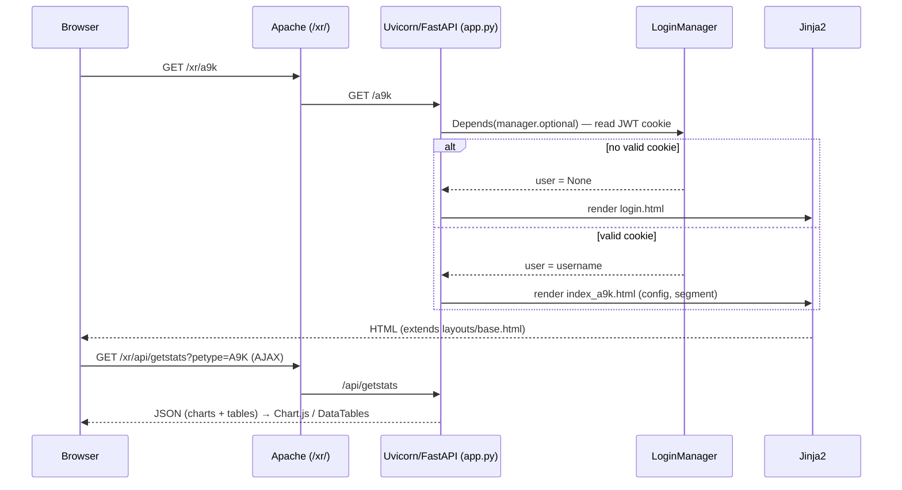
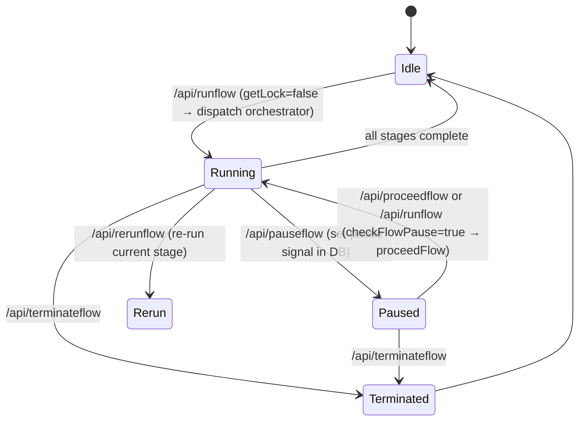

# 04 — Runtime & Request Flow

← [Folder Structure](03-folder-structure.md) | Index | Next: [Services](05-services.md) →

This document explains how the application behaves at runtime: startup, the request
lifecycle, and — most importantly — the **flow / stage execution model** that is the core
control abstraction of SSM.

## Startup sequence (`ssm-tool.service`)

```
systemd starts: python app.py  (MODE=production, PORT=8443)
        │
        ▼
app.py import time:
  os.environ['PETYPE'] = "XR"          # set BEFORE importing params
  import params as P                    # load all config/constants
  import nodeinfo, schemas              # inventory + request models
  from functions import ...             # logging, auth, log viewer helpers
  from functions_xr import getpairnode  # device automation
  from work_* import stages, orchestrator, runPreCheck, ...  # per-platform work
  from work_db import getLock, getNodeList, ...              # MongoDB access
        │
  app = FastAPI()
  manager = LoginManager(P.SECRET, '/auth/token', use_cookie=True)
  templates = Jinja2Templates("templates")
  app.mount("/static", ...)
  app.add_middleware(CORSMiddleware, allow_origins=['*'], ...)
        │
  @app.post/get decorators register all routes
        │
  if __name__ == "__main__":
      init_logger("ssm", "logs")        # configure root logger → logs/ssm.log
      logger.info("### SSM App started ###")
      uvicorn.run(app, host="0.0.0.0", port=8443)
```

Because all `work_*` modules are imported at startup, **any import-time error in any
platform module crashes the whole app.** Their module-level `stages` lists are also read at
import to render the runner UI.

The two compliance services start independently (see [Services](05-services.md)); they do
not import `app.py`.

## Request lifecycle — a page load



Key points:
- `basePath` in the browser (`scripts.html`) is derived from the first URL segment so AJAX
  calls stay under `/xr/` behind the proxy.
- Page routes use `manager.optional` (render login on failure); most `/api/*` use `manager`
  (reject on failure).

## The flow / stage model (the heart of the app)

### Vocabulary

| Term | Meaning |
|------|---------|
| **Flow** | One numbered unit of work against **one device**, shown as a vertical column in the runner UI. Flow numbers are ranges that map to orchestrators. |
| **Stage** | One step within a flow (`stage1`, `stage2`, …), drawn as an SVG box that glows while active. |
| **Orchestrator** | The function that runs a flow's stages in order for a platform+campaign. |
| **Lock** | A MongoDB record marking a flow as in-use; prevents double-runs and carries pause/terminate signals. |
| **CRQ** | Change Request ticket; a flow requires a valid CRQ (see [Glossary](12-glossary.md)). |

### Flow-number → orchestrator dispatch (`/api/runflow` in `app.py`)

| petype | flow range | Orchestrator | Status |
|--------|-----------|--------------|--------|
| A9K | 1–4 | `orchestrator` (work_a9k) | **disabled** (`return False`) |
| A9K | 11–20 | `orchestratorA9kisis` | **disabled** |
| A9K | 21–35 | `orchestratorA9ksph` (work_a9010_wipmgmt) | **active** — WIP-Mgmt split-horizon |
| A9903 | 1–10 | `orchestratorA9903` (work_a9903) | **active** — upgrade to XR 7.8.2 |
| A9903 | 11–20 | `orchestratorA9903bum` (work_a9903_bum) | **active** — BUM remediation |
| SPE | any | `orchestratorSpe` | **disabled** |
| ShSat | any | `orchestratorShSat` | **disabled** |

Disabled entries reflect completed campaigns; the code is retained for reference.

### Run / pause / stop lifecycle



- `getLock(flow, petype)` reads the lock. `runflow` only dispatches an orchestrator when
  **unlocked**; if locked+paused it resumes, if locked+running it no-ops.
- Pause/terminate are **cooperative**: the orchestrator checks DB signals between stages
  rather than being force-killed. (Confirm exact check points in the work_* deep-dive.)

### UI ↔ backend polling

The runner page (`runner.html`) polls `GET /api/getmap?type=PETYPE` **every 2 seconds** and
updates, per flow: node name, status text + color, lock state (disables inputs), and per
stage the glow animation, box color, and a click handler that opens the stage log via
`/api/getlog?id=<oid>`. This is how a long-running device procedure appears "live" in the
browser without websockets.

## Pre/post-check lifecycle (parallel, not flow-based)

Checks are mode-based, dispatched by `POST /api/workflow` → `runworkflow`:

```
WFData(mode, worktype, devicelist, crq, ...)
   │  addOnDemand(user, mode, worktype, devicelist, crq, flow)  → register nodes in DB
   ▼
ThreadPoolExecutor(max_workers=20):
   for each device:
       submit preCheckTask / postCheckTask / preWorkTask
       time.sleep(5)                     # 5s stagger between submissions
   │
   ▼ routing inside each task (by worktype + device name substring):
   ShSat/DhSat        → runPreCheckSat / runPostCheckSat   (work_satellite)
   MgmtEVPN*          → runPreCheckMgmt / runPostCheckMgmt  (work_mgmt_evpn)
   "-spe-" in name    → runPreCheckSpe / runPostCheckSpe    (work_spe)
   "-e-"  in name     → runPreCheck / runPostCheck          (work_a9k)
```

Results are written to MongoDB; the workflow page polls `/api/getmap` and renders a
comparison table (pre vs post). Post-check flags regressions (e.g. traffic rate < 30% of
pre-check value for satellites).

## Shutdown

There is no explicit shutdown hook. systemd stops the process; in-flight `pexpect` sessions
are not gracefully closed on SIGTERM (a risk — see [Improvements](11-improvement-recommendations.md)).
Flow locks persist in MongoDB across restarts, so a flow interrupted by a restart remains
"locked" until manually terminated/rerun.

## Gaps / needs confirmation

- Exact cooperative pause/terminate check points inside orchestrators (work_* deep-dive).
- Whether orchestrators run synchronously in the request thread or are handed to a
  background thread/executor (the `/api/runflow` handler appears to call them inline —
  confirm in `work_a9903.py` / `work_a9010_wipmgmt.py`).
