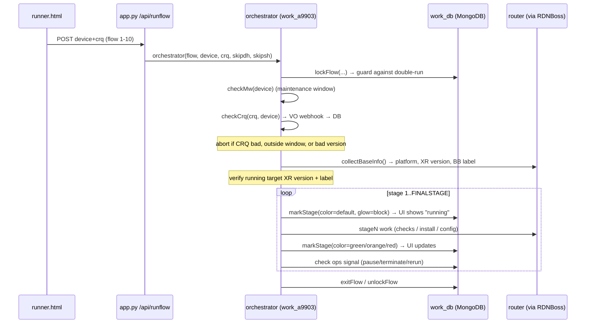

# 07 — Device Workflows

← [API Reference](06-api-reference.md) | Index | Next: [Module Reference](08-module-reference.md) →

This is the networking-heavy chapter. It explains how SSM actually talks to routers, and the
two procedure shapes it runs: **multi-stage flows** (upgrades/migrations) and **pre/post
checks** (validation). Networking terms are defined in the [Glossary](12-glossary.md).

## How SSM reaches a router (the connection path)

SSM never connects to a router directly. Every device session is a chain of `pexpect`
terminal sessions through a jump host:

```
Python (functions.jumphost_connect)
  └─ pexpect.spawnu("ssh … user@RDNBoss")     # functions.py:204
       expect 'assword:' → send jump pwd → expect '@RDNBoss:' prompt
  └─ functions.ssh_connect_jumped(device, jump, user2, pswd2)   # functions.py:251
       jump.sendline("ssh … user2@device")
       expect 'assword:' → send device pwd → expect '{device}#'
       send P.CMD0  (terminal length 0 / width 132 / monitor disable)
  └─ session (a pexpect.spawn) now sits at the device CLI prompt
```

Key facts a maintainer must know:
- **`jumphost_connect`** picks a jump host at random from `P.JUMPHOST["hosts"]`, retries up to
  40 times cycling hosts, sleeping 7s between attempts. It classifies failures (immediate
  reject / no prompt / timeout / auth failure) for the logs.
- **`devConnect`** (functions.py:397) is the normal entry point: it connects *and* attaches a
  per-stage log file (`session.logfile_read = open(logname)`), so the raw device transcript
  is captured to `logs/` automatically. This is what the Log Viewer shows later.
- Commands are sent with **`functions_xr.cliSend(trad, cmd)`** (functions_xr.py:28) which
  sends a line and `expect`s the prompt, returning the text between. `configureLines`
  (functions_xr.py:87) enters config mode and can `commit`, honoring `dryrun_only`.
- Output is turned into structured rows by **`parseCliOutput(template, text)`**
  (functions.py:753) which runs a TextFSM template from `textfsm/`.

There is a second jump host, **SharedBoss** (`P.SHBOSS`), used in parallel with RDNBoss for
access-node reachability pings (`pingAccessNodes`).

## The IOS-XR upgrade primitives (background)

An IOS-XR software upgrade is *add → activate → commit* (see Glossary). SSM implements each
step as a helper, mostly in `work_a9k.py` / `work_spe.py` calling into `functions_xr.py`:

| Concern | Function(s) | File |
|---------|-------------|------|
| Stage image onto device (copy + md5 verify) | `imgFilePrepare`, `imgFileTransfer`, `xrFileCopy`, `checkFileReady` | functions_xr.py |
| Free up disk before install | `checkDiskSpace`, `cleanDiskSpace`, `installCleanup` (uses `P.DC`) | functions_xr.py |
| Activate the ISO/GISO | `isoActivate`, `smuActivate` | work_a9k.py / work_spe.py |
| Commit the install | `installCommit` | work_a9k.py |
| Upgrade component firmware | `fpdUpgrade`, `fpdUpgradePsu` | functions_xr.py |
| Upgrade attached satellites | `upgradeShSatellites`, `upgradeDhSatellites`, `upgradeSatellites` | work_a9k.py |
| Traffic steering (redundancy) | `runTsScript`, `executeTs`, `rollbackTs` (calls `xr-steer.ssm.pl` on RDNBoss) | work_a9k.py |

The images, target versions, and md5s all come from **`params.PL[platform]`**.

## Shape 1 — a multi-stage flow (upgrade / migration)

A flow runs one platform's `orchestrator(flow, device, crq, skipdhsats, skipshsats)`. Using
`work_a9903.orchestrator` (the clearest active example, work_a9903.py:93) as the template, the
sequence is:



### Guard rails before any change (from the orchestrator body)

Before the first real stage, the orchestrator enforces (work_a9903.py:120–175):
1. **Lock** the flow (`lockFlow`); if already locked and not by this run, stop.
2. **Maintenance window** — `checkMw(device)` (functions.py:172); production changes only
   allowed in the device's window (e.g. after 23:00). Bypassed when `MODEL`.
3. **CRQ validity** — `checkCrq` must return a good status; the CRQ string must be `CRQ` +
   15 chars. A bad CRQ or "state something different" aborts.
4. **Base info** — `collectBaseInfo` must log in and confirm the device is on the expected
   `XrVer` and Base-Build `label` from `params.PL[platform]`. Wrong version → abort (unless
   `MODEL_SKIP`).

Only then does it iterate stages. Each `stageN` is a thin wrapper that calls a `stage*`
building block (e.g. `work_a9903.stage1` → `stages.stageCheckMulti(..., 'pre', ...)`).

### Pause / rerun / terminate (cooperative)

Control is **cooperative via MongoDB**, not signals. The UI buttons write an `ops` record
(`pauseFlow`/`rerunFlow`/`terminateFlow` in work_db.py); the orchestrator checks that record
between stages and at pause points. `stages.stageCheckMulti` itself calls `pauseFlow` when a
pre-check fails but continuation is allowed, and `terminateFlow` when it must stop
(stages.py:288–299). This is why a stage blocked inside a long `expect` won't react to Stop
until it returns — see [Improvements](11-improvement-recommendations.md).

### Failure & rollback

- A stage returns `(status, msg)`; on failure the orchestrator marks the stage red, writes
  the Proceed/Rerun/Terminate buttons (`buttons1`/`buttons2`), and typically pauses so an
  operator can decide.
- Traffic-steering rollback is explicit: `stageRollbackTs` / `rollbackTs` restore steering.
- Satellite migration supports a `rollback` flag end-to-end (`MigrationData.rollback`) that
  swaps src/dst roles (`MigrationData.create`, schemas.py:62).
- There is **no automatic full-upgrade rollback**; recovery is operator-driven via the
  Rerun/Terminate controls and platform-specific rollback stages.

## Shape 2 — pre / post / interim checks (validation)

Checks are the most-used feature and the safest to read first. Dispatched by
`POST /api/workflow` → fanned out over `ThreadPoolExecutor(20)` → per-device `runPreCheck*` /
`runPostCheck*`. Each of those calls a `stagePreCheck`/`stagePostCheck` wrapper that calls the
shared **`stages.stageCheckMulti`** (stages.py:49).

What `stageCheckMulti` does (the heart of validation):
1. `execChecks(devicelist, checktype, full, sdb, …)` (functions_xr.py:2063) logs into each
   device and runs the CLI capture + `cliChecks` parse, plus optional **Service-DB** check
   (`sdbPrePost`).
2. It computes a rich per-device snapshot: interfaces up/down, admin-down count, CDP
   neighbors, OSPF up/enabled, LDP, pseudowires (PW) up/down, attachment circuits (AC)
   up/down, BGP up/down (global + VRF v4/v6), NTP sync, DNS, satellite status, SPE ring walk,
   ECLL and pair-NNI bundle health.
3. **Pre-check** stores the snapshot and flags hard failures (a failed "hard rule" blocks
   continuation). **Post/interim** loads the stored pre-check (`getLatestCheckResult`) and runs
   `compareChecks` (functions_xr.py:1374) to diff before vs after; regressions (e.g. a PW that
   was up now down, or a service UP→DOWN in Service-DB) turn the result red.
4. It writes colored HTML into the stage log via `markStage`, so the workflow page's polling
   renders PASS/WARNING/FAIL and the deviation list.

Satellite and Mgmt-EVPN checks pass a `mdatalist` of `MigrationData` so the same engine also
compares migration-specific state (service status moved correctly, MAC learning on new BDs,
traffic rate ≥ 30% of pre-check).

## Platform-specific notes

- **A9903 upgrade (flows 1–10, `work_a9903.py`)** — 14 `stageN` functions; standard
  pre-check → image transfer → GISO install → FPD → post-check shape. `maxhour = 7` bounds
  the run. `restriction='pair'` prevents locking both nodes of a redundant pair at once.
- **A9903 BUM (flows 11–20, `work_a9903_bum.py`)** — 11 stages; BB uplift + BUM-traffic
  remediation config, same guard rails.
- **A9010 WIP-Mgmt split-horizon (flows 21–35, `work_a9010_wipmgmt.py`)** — the core work is
  `stageApplySPH` (work_a9010_wipmgmt.py:37), which applies split-horizon to WIP-management
  ACs. Honors `config.ini` `dryrun_only` and `allow_infrabs`.
- **SPE upgrade (`work_spe.py`, flows 1–10, disabled in app)** — 10 stages; includes
  `maxMetric`/`deMaxMetric` (cost-out/cost-in via IGP metric so traffic avoids the node
  during upgrade), `smartlicense`, `wCSCvt27458` (a specific SMU/defect cleanup), NCS540 vs
  NCS55A2 handled via `platform`.
- **Satellite migration (`work_satellite.py`)** — `getSatInfo`, `stageIntfdescCheck`,
  `stageMigration`, `stagePreCheckSat`/`stagePostCheckSat`; SH vs DH decided by name
  substring (`-ss-` / `-ds-`) in `MigrationData.__init__`.
- **A9K upgrade (`work_a9k.py`, disabled)** — retained for its shared primitives (traffic
  steering, satellite upgrade, install/commit) reused elsewhere.

## Gaps / needs confirmation

- Exact per-stage command sequences (each `stageN` delegates to a `stage*` helper; the CLI
  strings live in `functions_xr.py` capture functions and `params.CLICAP`/`CLILIST`).
- Which check consumes each TextFSM template (the mapping from `cliChecks` parse calls to
  templates). The 24 templates in `textfsm/` cover: version/platform (`show_version`,
  `show_platform`, `admin_show_platform`), routing (`show_bgp_all_all_summary`,
  `show_ospf_neighbor`/`_interface_brief`, `show_mpls_ldp_neighbor_brief`, `show_bfd_session`),
  L2 (`show_bundle`/`_brief`, `show_l2vpn_bridge-domain`/`_brief`/`_forwarding..._mac-address`),
  neighbors (`show_cdp_neighbor`/`_detail`, `show_lldp_neighbors_detail`), satellites
  (`show_nv_satellite_status`/`_brief`, `show_environment_nv_satellite`), interfaces
  (`show_interface_description`/`_rate`), and ops (`show_ntp_associations`, `show_media`,
  `show_hwmodule_fpd`).
- Precise `FINALSTAGE` constants per module (defined near the top of each `work_*`).
